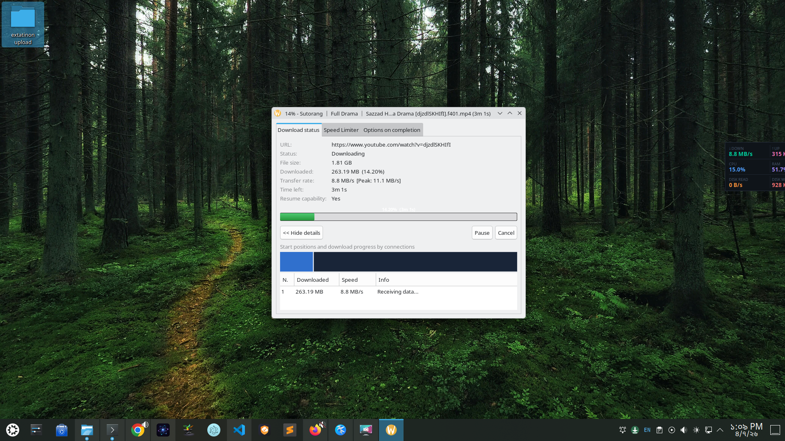
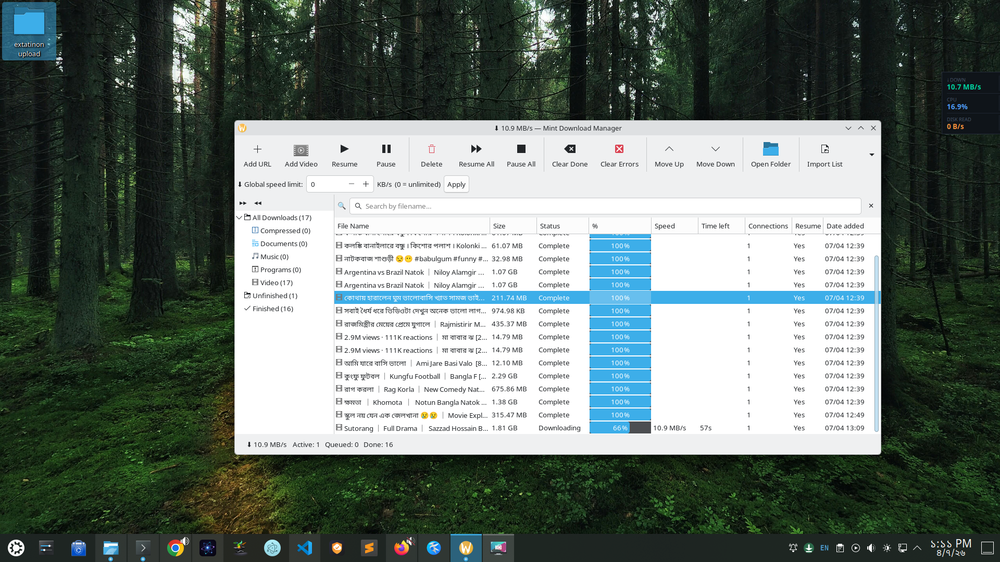

# Mint Download Manager

Mint Download Manager is an IDM-style download manager for Linux with browser integration.
It captures browser downloads, accelerates file transfers with aria2, and provides a desktop GUI with tray controls and live progress.

## Screenshots

## Highlights

- Automatic browser download capture
- Multi-connection downloads via aria2 (up to 16 connections per file)
- Smart file naming and category-based folder sorting
- Video downloader support (yt-dlp + ffmpeg) for many sites
- System tray menu (Open, Pause All, Resume All, Quit)
- Per-download progress dialog with speed, ETA, and connection details
- Desktop notifications for start, complete, pause, resume, and errors

## Install

### Debian, Ubuntu, Linux Mint

From the project folder:

  sudo apt install ./dist/mintdm_1.1.0_all.deb

Or:

  sudo dpkg -i ./dist/mintdm_1.1.0_all.deb
  sudo apt-get install -f -y

### RPM-based distros

  sudo rpm -Uvh ./dist/mintdm-1.1.1-1.noarch.rpm

## Run

- Start GUI (auto-starts daemon if needed): mintdm-gui
- Start daemon only: mintdm
- Stop daemon: mintdm-stop

Quick health check:

  curl http://127.0.0.1:9001/ping

## Browser Extension Setup

### Firefox (Recommended: AMO)

Install directly from Mozilla Add-ons:

  https://addons.mozilla.org/en-US/firefox/addon/mint-download-manager/

### Chrome, Chromium, Brave, Edge

Download extension package from GitHub Releases:

  https://github.com/mostafijar/mintdm/releases/latest/download/chrome.extension.zip

Install steps:

1. Open the extensions page:
   - Chrome: chrome://extensions
   - Edge: edge://extensions
   - Brave: brave://extensions
2. Enable Developer mode.
3. Download and extract chrome.extension.zip.
4. Click Load unpacked.
5. Select the extracted extension folder (the folder containing manifest.json).

Alternative for local builds:

  /usr/share/mintdm/extension

## Download Categories

Files are auto-sorted under your Downloads folder into:

- Compressed
- Documents
- Music
- Programs
- Video

## Progress Display Compatibility

Reliable on all desktops:

- Tray icon progress
- Per-download dialog progress

Best-effort (desktop/session dependent):

- Taskbar icon progress

Behavior may vary by desktop environment and Wayland/X11 session.

## Build From Source

After editing files in app:

  ./build-all.sh

Packages are generated in dist.

## Troubleshooting

- Keep yt-dlp updated for better video-site compatibility.
- If a site blocks direct fetching, enable cookie forwarding in extension settings.
- If taskbar progress is missing, use tray icon and progress dialog (fully supported).

## Links

- GitHub repository: https://github.com/mostafijar/mintdm
- Firefox add-on (AMO): https://addons.mozilla.org/en-US/firefox/addon/mint-download-manager/
- Chrome extension package: https://github.com/mostafijar/mintdm/releases/latest/download/chrome.extension.zip

## Uninstall

Debian/Ubuntu/Mint:

  sudo apt remove mintdm

